## TODO

- [ ] 添加 NUMA 架构图
- [ ] 更详细的 NUMA 架构说明
- [x] 更详细的稀疏内存模型介绍
- [ ] 添加 Linux 内存模型发展图
- [ ] 添加二叉树图片来源 https://coolshell.cn/articles/10427.html
- [ ] 也许 buddy system 一节可以增加空闲列表的图示
- [ ] 添加内存模型实现的 node、zone 和 ZONE_TYPE 说明
- [ ] 添加 buddy system 分离减半图示？
- [ ] 内存模型添加 NUMA mem policy 介绍
- [ ] 内存模型添加平坦内存模型 page_to_pfn 快的意义
- [ ] 添加论文引用
- [ ] 考虑将 kmem_cache 接口介绍改成表，并且增加更详细的介绍，alloc 的 flag 是 gfp_t
- [ ] 调试功能，添加论文引用

## 绪论

### 背景与意义

研究动力
研究目标
研究对象 局限于物理内存的分配与释放

### 现代操作系统内存分配器概述

Linux 是目前市场占有率最高、影响力最大的开源操作系统内核，而且是云计算的基石。因此，笔者以 Linux 内核为例，概述现代操作系统内存分配器的发展情况。

目前，内存管理子系统是 Linux 内核最复杂的顶级子系统，以最新（截止 2023 年 5 月）的 Linux v6.2 版本为例，Linux 源代码目录 mm 共计 176 个文件、182932 余行代码（包括注释和空行），而作为云计算基石的 KVM（Kernel-based Virtual Machine）源代码仅有 9396 余行。

KVM 代码统计如下：

| Language | Files | Lines | Code | Comments | Blanks |
| -------- | ----- | ----- | ---- | -------- | ------ |
| C        | 10    | 9271  | 6451 | 1273     | 1547   |
| C Header | 4     | 121   | 75   | 26       | 20     |
| Makefile | 2     | 4     | 2    | 2        | 0      |
| Total    | 16    | 9396  | 6528 | 1301     | 1567   |

内存子系统代码统计如下：

| Language | Files | Lines  | Code   | Comments | Blanks |
| -------- | ----- | ------ | ------ | -------- | ------ |
| C        | 151   | 178276 | 113360 | 40752    | 24164  |
| C Header | 20    | 4424   | 2869   | 860      | 695    |
| Makefile | 5     | 232    | 178    | 26       | 28     |
| Total    | 176   | 182932 | 116407 | 41638    | 24887  |

内存管理子系统是操作系统内核最核心、最底层的子系统，被其余所有子系统依赖。因此，优秀的内存分配器必须做到以下几点：

1. 低内存碎片：内存碎片会导致系统内存资源利用率下降，甚至导致系统无法分配内存。

对于内存分配负载大的工作流（如游戏服务器）以及长期运行的系统（如移动设备），低内存碎片尤为重要。Linux 内核通过页面合并、内存重整、伙伴系统和 slab 分配器结合等技术降低内存碎片。

2. 低延迟：内存分配器应该尽可能地快速响应内存分配请求，以减少进程等待时间和系统负载。

低延迟的内存分配对于中断处理例程尤为重要。以接收网络包为例，网卡接收到数据包后，会向 CPU 发送中断信号，陷入到中断处理程序（interrupt handler）。中断处理程序必须尽快响应网卡的中断请求，并将数据包从网卡的接收缓冲区复制到内核的网络接收缓冲区（socket buffer）中，完成复制后才可以响应下一次网卡的中断请求。如果内存分配器的延迟过大甚至无可用内存，会导致中断处理程序失败或等待可用内存，极大降低系统吞吐量。

为此，Linux 内存分配器会系统保留一部分内存作为紧急内存池，用于系统内存吃紧时兜底。并通过 slab 分配器、内存池缓存生命周期短且可以循环利用的对象，以降低分配延迟。

3. 可扩展性：内存分配器应该能够处理不同规模的内存分配请求，能够适应系统负载的变化。

内存分配器既要能高效地支持小块内存分配，也应该支持大块内存分配，并且不局限于特定大小。例如，使用分离链表算法的内存分配器，会缓存特定大小的内存块，请求这些特定大小的内存块是时，响应时间极短，但对于其他大小的内存请求响应时间更长。

4. 内存安全：内存分配器应该能够确保内存分配和释放的安全性，避免内存泄漏和内存越界等问题。

5. 可定制性：内存分配器应该允许用户自定义内存分配策略，以适应特定的应用场景和系统需求。

例如在 x86 架构下，只有物理地址低于 32M 的物理内存可以用于 DMA，内存分配器必须能支持分配物理地址低于 32M 的物理内存。

除了这些传统的目标外，随着硬件技术的进步，目前操作系统内存分配器必须支持 NUMA 架构、内存热插拔、多核处理器等。

#### NUMA 架构

_NUMA_（Non-uniform memory access) 即“非一致内存访问”，在高端服务器领域越来越流行。

在一个 NUMA 架构中，CPU 和内存被划分为多个节点，每个节点通常有多个 CPU 和多个内存控制器，节点通过高速互联网络连接在一起。每个 CPU 都有本地内存和远程内存，本地内存直接连接到本地 CPU，而远程内存需要通过互联网络连接到远程 CPU。因此访问本地内存的延迟比访问远程内存的延迟要小。因此，在 NUMA 架构中，需要对内存进行合理的分配，以充分利用本地内存，并尽量减少访问远程内存的次数，以提高系统的性能和效率。

NUMA 架构下不仅 CPU 访问本地内存和远程内存延迟不同，而且内存地址空间也变得更加稀疏和不连续，操作系统内核内存分配器必须应对这一挑战。

#### 内存热插拔

内存热插拔技术是一种可以在服务器运行时添加或删除物理内存的技术。使用内存热插拔技术在不停机的情况下进行增删物理内存是云计算时代下的基本需求。

内存热插拔技术在云计算中至少有以下典型应用场景：

1. 虚拟机内存扩容：云计算中的虚拟机通常会运行多个不同的应用程序，这些应用程序的内存需求可能随时变化。通过内存热插拔技术，虚拟机可以在运行状态下扩展内存，以满足应用程序的内存需求。
2. 虚拟机故障修复：虚拟机中的内存模块可能会出现故障，导致虚拟机无法正常运行。通过内存热插拔技术，可以在不影响虚拟机运行的情况下，快速替换故障的内存模块，恢复虚拟机的正常运行。

内存热插拔不仅需要硬件支持，更需要操作系统支持。内存管理子系统必须能够检测物理内存的插入和拔出，在插入时检测物理内存并将其纳入到内存子系统的管理之下，拔出内存时必时必须将内存的将内存中的数据迁移到系统的其他物理内存中，避免内存错误。

#### 多核处理器

在多核系统中，多个 CPU 可能同时请求内存，如果内存分配器不能很好地扩展，就会出现竞争和互斥等问题，从而导致性能瓶颈，甚至性能远低于单核系统。

为了提高内存分配器的可扩展性，Linux 内存子系统大量使用本地 CPU 缓存。Linux 内核中的几乎所有内存分配器都为每个 CPU 分配自己的本地缓存，优先从本地缓存分配内了存，以避免线程间同步。

#### 内存安全与调试

通常，内核检测的内存安全 bug 可以分为以下几类：

1. OOB(Out Of Bound)：内存访问越过了已分配内存的边界。
2. UAF(Use After Free)：访问已释放的内存。
3. Invalid Free: 无效释放，即内存释放函数（如 C 标准库的`free()`）释放的内存不是之前分配的内存。
4. Double Free：二次释放，即释放内存后又通过内存释放函数释放内存。

内存安全 bug 会对内核稳定性产生负面影响。[AOSP 安全性文档](https://source.android.google.cn/docs/security/memory-safety?hl=zh-cn)指出，内存安全 bug 和以原生编程语言处理内存时遇到的错误是 Android 代码库中最常见的问题。此类问题造成了超过 60% 的高严重程度安全漏洞，并造成了数百万次用户可见的崩溃。从第一个 Android 版本开始，内存安全 bug 就一直是 Android 安全漏洞的首要原因，约占 Android 安全漏洞的 51%。


随着代码的复杂性不断增长，如果一直坐视不管，内存安全 bug 的数量将随着时间的推移而持续增加。因此，现代操作系统必须提供检测并缓解此类 bug 的工具。

Linux 内核于 6.1 版本开始支持使用 Rust 语言编写驱动程序，试图通过引入内存安全型编程语言环境内存安全问题。此外，从 Linux 2.x 版本开始，Linux 内核就将内存安全 bug 检测作为内存管理子系统的重要功能。目前，Linux 内核中的几乎所有类型的内存分配都有对应的内存安全 bug 检测器，主要分为以下三种：

1. 内存分配器内置的调试功能：内存分配器在分配内存和释放时，检测是否发生内存安全 bug。这种方式无法在发生内存安全 bug 时立刻报告错误，但性能损耗比较小。

2. KASAN(The Kernel Address Sanitizer)：使用 shadow memory 记录所有内存的使用情况（正常/异常），即使用 1 字节记录 8 个字节的使用情况；通过编译器的协助，在内核代码的每一条内存访问指令前插入 KASAN 检测指令，检测是否出现内存安全 bug。KASAN 在每条内存访问指令前插入 KASAN 检测指令，导致严重的性能损耗；KASAN 使用 1 字节记录 8 个字节的使用情况，因此会占用系统总内存的 1/8。尽管 KASAN 不能用于生产环境，但可以及时报告内存错误，是 Linux 内核中功能最强的内存安全 bug 检测器。

3. KFENCE(Kernel Electric-Fence)：在 Linux 5.12 版本引入，仅检测通过 KFENCE 内存池分配的内存（kfence 对象），而且是周期性采样。KFENCE 性能开销比较低，可以用于生产环境，因此 Linux 5.12 版本后默认开启 KFENCE。

Linux 内核的三大类内存安全 bug 检测器总结如下：

| Debugger   | Overhead      | OOB                | UAF                | invalid free       | double free        |
| ---------- | ------------- | ------------------ | ------------------ | ------------------ | ------------------ |
| slub_debug | 中等            | 对象被释放时             | 对象被重新分配时           | 立即                 | 立即                 |
| kasan      | 非常高，不可用于生产环境。 | 立即                 | 立即（对象被重新分配后不再检测）   | 立即                 | 立即                 |
| kfence     | 低，可用于生产环境。    | 立即或当 kfence 对象被释放时 | 立即（仅适用于 kfence 对象） | 立即（仅适用于 kfence 对象） | 立即（仅适用于 kfence 对象） |

### 论文主要工作与组织结构

第一章：绪论。首先阐述了论文选题的背景和意义，随后介绍了操作系统内存管理子系统的目标，最后概述了 Linux 内核内存管理子系统的最新进展。

第二章：内存模型。首先概述 Linux 内核的内存模型演化，然后介绍本系统使用的内存模型与相关数据结构。

第三章：页分配器。本章描述本系统如何跟踪物理页分配情况，然后介绍页分配器的初始化，最后详细介绍 CPU

第四章：对象分配器。

第五章：通用内存分配器。

## 内存模型

_内存模型_（_memory model_）指操作系统对物理内存的管理方式和组织结构。

Linux 内核的内存模型经历了三个阶段：平坦内存模型、非连续内存模型和稀疏内存模型。

### 平坦内存模型

在大多数处理器架构中，物理内存仅仅是物理地址空间的一部分，物理地址空间通常是不连续的，其中不可用的部分称为*内存空洞*（_memory hole_）。内存空洞包括：架构保留的区域，内存映射 IO，ROM 等等。

x86_64 典型的物理地址空间如下：

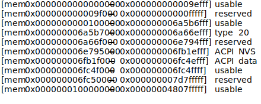

x86_64 架构中，前 1MB 物理地址空间称为*实模式地址空间*，以实模式地址空间为例，说明物理地址空间的复杂性：

| start                                   | end        | size                | description                            | type                                 |                                            |
| --------------------------------------- | ---------- | ------------------- | -------------------------------------- | ------------------------------------ | ------------------------------------------ |
| Real mode address space (the first MiB) |            |                     |                                        |                                      |                                            |
| 0x00000000                              | 0x000003FF | 1 KiB               | Real Mode IVT (Interrupt Vector Table) | unusable in real mode                | 640 KiB RAM ("Low memory")                 |
| 0x00000400                              | 0x000004FF | 256 bytes           | BDA (BIOS data area)                   |                                      |                                            |
| 0x00000500                              | 0x00007BFF | almost 30 KiB       | Conventional memory                    | usable memory                        |                                            |
| 0x00007C00                              | 0x00007DFF | 512 bytes           | Your OS BootSector                     |                                      |                                            |
| 0x00007E00                              | 0x0007FFFF | 480.5 KiB           | Conventional memory                    |                                      |                                            |
| 0x00080000                              | 0x0009FFFF | 128 KiB             | EBDA (Extended BIOS Data Area)         | partially used by the EBDA           |                                            |
| 0x000A0000                              | 0x000BFFFF | 128 KiB             | Video display memory                   | hardware mapped                      | 384 KiB System / Reserved ("Upper Memory") |
| 0x000C0000                              | 0x000C7FFF | 32 KiB (typically)  | Video BIOS                             | ROM and hardware mapped / Shadow RAM |                                            |
| 0x000C8000                              | 0x000EFFFF | 160 KiB (typically) | BIOS Expansions                        |                                      |                                            |
| 0x000F0000                              | 0x000FFFFF | 64 KiB              | Motherboard BIOS                       |                                      |                                            |

尽管物理地址空间如此复杂，但总体上内存仍然是连续的。平坦内存模型将物理地址空间视作由连续的物理页组成的数组，并使用数组`struct page mem_map[]`跟踪每一页的状态，包括是否已分配等等。


平坦内存模型有以下优点：

- 符合直觉，实现简单。

- 快速进行`struct page*`和物理页号`pfn`的转换。

### 非连续内存模型

二十一世纪初，NUMA 架构的逐渐普及，导致物理内存更加稀疏，平坦内存模型的问题暴露出来：

- 无法应对大量内存空洞：平坦内存模型使用全局数组`mem_map[]`追踪每个物理页的状态，即使某些页帧对应的物理地址没有实际的内存，Linux 也要为其分配`struct page`结构体，存在大量内存空洞意味着`mem_map[]`中相当一部分`struct page`被浪费。

- 不支持 NUMA 架构：NUMA 架构将内存划分为多个节点，而平坦内存模型却将物理内存视作一个连续的物理页数组。

为了克服平坦内存模型的上述问题，1999 年开始 Linux 引入了非连续内存模型以支持 NUMA 架构，该内存模型称为 DISCONTIGMEM。

在非连续内存模型中，内存被划分为多个节点，每个节点都有自己的`mem_map[]`数组，跟踪本节点内的物理页。


尽管非连续内存模型是为了支持 NUMA 架构而发生的，但非连续物理内存模型是操作系统的软件视角，不一定准确反映硬件 NUMA 布局。例如，操作系统可以把任意一块连续内存视作一个节点，而不用考虑硬件上 NUMA 架构的真实布局。论文后续部分会详细介绍。

### 稀疏内存模型

物理内存热插拔技术的进步，支持物理内存热插拔成为了对内核内存管理子系统的基本要求。在云计算场景下，往往需要通过内存热插拔可以用来实现动态扩容，但频繁的内存插拔也使得物理内存更加不连续。

内存热插拔技术使得大范围的连续物理内存不再场景，稀疏的物理内存称为常态。非连续内存模型尽管使得 Linux 成功支持 NUMA 架构，但非连续内存模型实际上只是连续物理内存的变体，每个节点内部都是连续内存模型。内存热插拔场景下的物理内存过于稀疏，粗粒度的非连续内存模型无法支持如此稀疏的物理内存布局。

因此，Linux 于 2005 年引入了原始的稀疏内存模型，称为 SPARSEMEM。SPARSEMEM 模型把粗粒度的节点，变成了更细粒度的`struct mem_section`。每个`mem_seciton`都有自己的内存管理结构`mem_map[]`，一个`mem_section`管理$2^{SECTION\_SIZE\_BIT}$字节物理内存，通常`SECTION_SIZE_BIT` 定义为 27，即一个`mem_section` 管理 128MB 内存。整个系统的内存管理结构被视作一个`mem_section`数组[^1]。

将 FLATMEM 模型中 `struct page` 必须从物理地址开始到结束而连续存在，变成了 `struct mem_section` 必须连续存在。在内存空洞的场景下，只需要每 128 MB 的物理地址空间存在一个 `struct mem_section` 即可（不要求分配`struct page`结构），而无需为每 4 KB 的物理地址空间都分配一个 `struct page`，减少了不必要的内存开销。而且，`mem_section`有上线和下线两个状态，对应内存的插入与拔出，通过 `struct mem_section` 的动态初始化与销毁实现物理内存热插拔。


经典 SPARSEMEM 模型有两大缺点：

1. `mem_section[]`数组是固定分配的，而且覆盖整个物理地址空间，这会大量浪费内存。64 位处理器的地址空间极大，64 位 RISCV 架构支持$2^{56}$字节地址空间，x86_64 架构支持$2^{52}$字节或$2^{46}$字节物理地址空间，要覆盖 RISCV 架构的$2^{56}$字节物理地址空间，需要分配$2^{29} = 536,870,912$个`mem_section`结构体。

2. 页帧编号和`struct page*`之间的转换开销比平坦内存模型大。

这两个问题阻碍着 SPARSEMEM 完全替代 DISCONTIGMEM 内存模型，这两个问题已经分别通过 2005 年引入的 SPARSEMEM-EXTREME 拓展和 2007 年引入的 SPARSEMEM-VMEMMAP 拓展解决了。

SPARSEMEM-EXTREME 将经典 SPARSEMEM 内存模型的`mem_section[NR_SECTION_ROOTS][1]`改成动态分配的`mem_section[NR_SECTION_ROOTS][SECTIONS_PER_ROOT]`，当某个`mem_seciton[SECTION_PER_ROOT]`对应的地址空间是内存空洞时，就不需要为其分配`struct mem_seciton`数组，从而减少了内存消耗。


SPARSEMEM-VMEMMAP 拓展的思路是：在 SPARSEMEM 中，`struct page` 为应对内存空洞，实际上不会连续存在，但可以设法安排每个 `struct page`（不管其存在与否）的虚拟地址是固定且连续的，因为分配虚拟地址并不会有实际的开销，反而可以方便进行索引。SPARSEMEM-VMEMMAP 内存模型可以如同平坦内存模型一样快速进行页帧编号和`struct page*`的切换，使得稀疏内存模型可以完全替代平坦内存模型和非连续内存模型。

2021 年提交补丁[Remove DISCINTIGMEM memory model](https://lwn.net/Articles/858333) 彻底移除了 DISCONFITMEM 内存模型，SPARSEMEM 内存模型成为 Linux 内核的默认内存模型。

### 本论文使用的内存模型及其实现

教学操作系统没有对内存热插拔的需求，非连续内存模型支持 NUMA 架构，并且复杂度适中，因此论文描述的系统实现了非连续内存模型。


目前本论文描述的操作系统是还不支持对称多处理器，因此将系统视为只有一个节点和一个 CPU 的 NUMA 架构机器，该节点并不包含整个物理地址空间，仅仅包含系统中的物理内存。节点内的物理内存被进一步划分为多个区域`struct zone`，每个区域都有自己独立的内存管理结构`struct page*mem_map`。上图展示了本论文实现的内存模型的逻辑结构。在实际的实现中，节点存储了整个节点内存区域的`struct page mem_map[]`，每个`zone`中的`struct page mem_map[]`只是指向节点的`mem_map[]`中对应区域的`struct page*`指针。物理结构如下图所示。


划分`zone`的依据是系统中不同区域的物理内存特性不同。例如，x86_64 架构中只有低 32MB 的物理内存能够用于 DMA，因此用于 DMA 的内存必须从该`zone`分配；在内存热插拔场景下，内核的代码数据要放在不会被下线（拔出）的内存区域中，而某些用户数据可以放在可能被下线的内存区域中，因此还应该将可能下线的内存区域划分为一个`zone`。本论文的实现基于 RISCV 架构，并且运行在 qemu 模拟器中，通过 virtio 协议操作外设，DMA 不对物理地址做限制，但仍然区分了常规内存分配请求和用于 DMA 的内存分配请求，将节点的内存划分为`ZONE_DMA`和`ZONE_NORMAL`区域，也许网络协议栈和驱动程序会有这方面的需求。

尽管目前不支持对称多处理器，无法完整地支持硬件 NUMA 架构，但已经在软件层面完成了绝大多数工作，未来支持对称多处理器后，只需要进行 NUMA 配置探测，初始化多个节点即可。

## 页分配器

_页分配器_（_page allocator_）指按页管理系统内存的分配与释放的内存分配器，是操作系统最基础的组件。本论文的页分配器使用的主要算法是*伙伴系统*（Binary Buddy Allocator），该算法由 Knowlton [Kno65] 设计并由 Knuth [Knu68] 进一步描述。与其他内存分配算法相比，伙伴系统有以下优点：

- 算法简单：伙伴系统算法相对简单，易于实现。该算法不需要维护大量的元数据信息，所以比其他算法更加轻量化和高效。

- 分配和释放高效：伙伴系统在分配和释放内存时，只需简单的合并或拆分节点即可。

- 在理想负载下没有内碎片：伙伴系统将内存划分为一系列大小相等的块，并且仅能分配$2^N$页，对于$2^N$页的内存分配请求不存在内存碎片的问题。

伙伴系统一种将普通的二次幂分配器与空闲缓冲区合并 [Vah96] 相结合的分配方案，其背后的基本概念非常简单。 内存被划分成内存块，每个内存块由$2^N$个连续的物理页组成，其中`N` 称为该内存块的*阶数*（_order_）。分配时如果没有所需大小的内存块，则将一个更大的内存块平分成两半，平分出来的内存块彼此互为伙伴。其中一个用于分配，另一半空闲。内存块会根据需要连续平分，直到平分出所需大小的内存块。 稍后释放一个内存块时，将检查它的伙伴的分配状态，如果它是空闲的，则将两者合并。合并得到新的空闲内存块后，再去检测它的伙伴，继续上述合并过程，知道无法合并。

伙伴系统有多种实现方式，如基于二叉树的实现通过一个数组形式的完全二叉树管理内存，二叉树的节点标记相应内存块的使用状态，高层节点对应阶数大的块，低层节点对应阶数小的块，在分配和释放中通过这些节点的标记属性来进行块的分离合并。

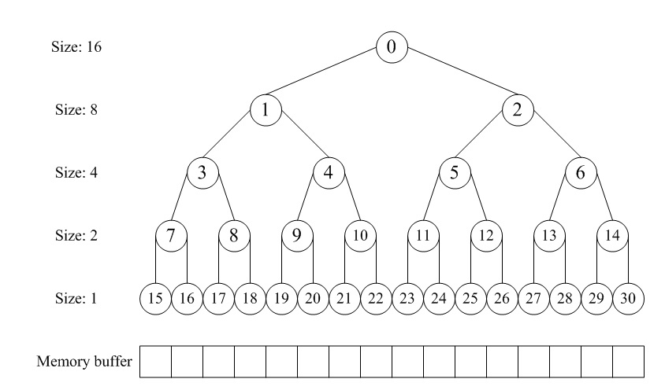

### 物理页管理

本系统为每个节点中的页帧都保留一个对应的`struct page`结构体，该结构体定义如下。

| 成员名称    | 数据类型                    | 描述       |
|:-------:|:-----------------------:| -------- |
| flags   | uint32_t                | 物理页状态    |
| count   | int32_t                 | 物理页使用者数量 |
| private | uint64_t                | 存储私有数据   |
| lru     | struct linked_list_node | 链表节点     |

系统要为每个跟踪的物理页保留一个`struct page`结构体，因此`struct page`的大小必须要足够小，以便保留足够多的可用内存。因此`struct page`是整个系统中最为复杂的结构体，其复杂性在于每个`struct page`的字段都是精心编码的，在不同的场景下有不同的含义。

`flags`保存物理页状态，包括物理页是否是被保留的（不可用于分配）、是否用于 slab 分配器、是否空闲等等。此外，`flags`的高 6 个字节还存储该页所属的`node` id 和`zone` id，因此只有 26 比特用于跟踪页面状态。

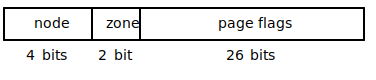

其余字段根据`flags`标示的状态有不同的含义。`private`状态存储页面相关的私有数据，目前仅用于页面被伙伴系统管理时标示内存块的阶数。`lru`是 _Last Recently Used_ 的简称，是一个链表节点，可用于页面置换；当页面空闲且被伙伴系统管理时，它用于标示下一块空闲内存块；当页面被分配给 slab 分配器时，`lru`用于记录该页面所属的 slab 和 cache。

本系统通过分离链表实现伙伴系统。如图所示，维护一个指向不同阶数的空闲内存块链表的数组`struct free_area free_zreas[MAX_GFP_ORDER+1]`。 数组的第 0 个元素指向一个阶数为 0 的空闲内存块链表，第 N 个元素指向阶数为 N 的空闲内存块链表，`MAX_GFP_ORDER`是伙伴系统支持的最大阶数。每个`zone` 独立管理自己的内存，因此每个`zone`有自己独立的伙伴系统。


`struct free_area`字段如下：

| 字段名称      | 数据类型                    | 描述           |
|:---------:|:-----------------------:|:------------:|
| free_list | struct linked_list_node | 空闲列表头指针      |
| nr_free   | int32_t                 | 空闲列表包含的空闲块数量 |

空闲块的第一页称为*首页*（_first page_），其余页面均称为*尾页*（_tail page_），首页的`struct page`代表整个空闲块的状态，`free_list`空闲列表指向第一个空闲块首页的`lru`链表节点，空闲块通过首页`struct page`的`lru`链表节点链接起来。

### 接口设计

伙伴系统提供的 API 如下：

| 函数声明                                                                           | 介绍                        |
|:------------------------------------------------------------------------------:|:-------------------------:|
| struct page *alloc_pages_node(struct node *node, uint32_t order, gfp_t flags); | 从节点`node`分配`order`阶内存块    |
| struct page \*alloc_pages(uint32_t order, gfp_t flags);                        | 从当前 CPU 所属节点分配`order`阶内存块 |
| struct page \*alloc_page(gfp_t flags);                                         | 从当前 CPU 所属节点分配一页内存        |
| void free_pages(struct page \*page, uint32_t order);                           | 释放首页为`page`的`order`阶内存块   |
| void free_pages(struct page \*page);                                           | 释放物理页`page`               |

其中`gfp_t`标志决定页分配器如何分配内存。`gfp_t`标志可以分为以下三大类：

- 调整行为：系统内存不足时，请求内存分配的进程可以休眠，等获取了内存的进程释放内存后再重试。但在中断处理例程中，进程不得休眠，否则迟迟不结束的中断处理例程会导致这期间的所有同类型中断丢失，严重影响系统吞吐量。

| gfp_t 标志        | 介绍           |
|:---------------:|:------------:|
| \_\_GFP_WAIT    | 允许内存分配导致进程休眠 |
| \_\_GFP_NORETRY | 内存分配失败后不再重试  |
| \_\_GFP_NOFAIL  | 内存分配失败后无限重试  |

- 调整内存分配区域：内存被划分为多个`node`节点，`node`节点的内存又被划分为多个`zone`，用户可以要求页分配器从特定类型的`zone`分配内存。

| gfp_t 标志       | 介绍                  |
|:--------------:|:-------------------:|
| \_\_GFP_NORMAL | 从 ZONE_NORMAL 区分配内存 |
| \_\_GFP_DMA    | 从 ZONE_DMA 区分配内存    |

- 内存分配类型：前两类`gfp_t`标志是最底层的`gfp_t`标志，需要用户了解页分配器的内部实现才能正确使用。页分配器根据内存分配类型组合前两类`gfp_t`提供给用户使用，用户应当优先使用描述内存分配类型的`gfp_t`标志。

| gfp_t 标志   | 介绍                                     |
|:----------:| -------------------------------------- |
| GFP_KERNEL | 内核常规的分配请求。从 ZONE_DMA 区分配内存，且可能阻塞进程。    |
| GFP_DMA    | 分配用于 DMA 的内存。                          |
| GFP_ATOMIC | 高优先级的内存分配请求，在中断处理函数和持有锁的关键区使用，不导致进程睡眠。 |

系统通过`struct page` 管理物理页，物理页的分配和释放都通过修改`struct page` 结构体实现，因此伙伴分配器的接口通过内存块首页的`struct page`指针来定位内存块。但从用户视角看，用户期望分配内存返回该内存块的起始虚拟地址，释放时传递该地址给伙伴系统的内存释放 API。因此，在伙伴系统提供的这些 API 之上，提供了用起始地址定位内存块的用户 API，其他子系统应该优先使用这些用户 API。用户 API 如下表所示。

| 函数声明                                          | 介绍                           |
|:---------------------------------------------:|:----------------------------:|
| void \*get_free_pages(uint32_t order);        | 分配`order`阶内存块，返回其起始虚拟地址。     |
| void \*get_free_page();                       | 分配一页内存，返回其起始虚拟地址。            |
| void free_pages(void \*addr, uint32_t order); | 释放起始虚拟地址为`addr`的`order`阶内存块。 |
| void free_page(void \*addr);                  | 释放起始虚拟地址为`addr`的页。           |

### 回退列表

在本系统的非连续内存模型下，不同`zone`区域之间并非是互斥的，而是具有一定的优先级关系，优先级关系如下：

1. 优先从本地节点分配：本地节点的`zone`优先于其他节点的`zone`。

2. 优先从目标类型的`zone`分配：`ZONE_NORMAL`区域优先于`ZONE_DMA`区域。

系统中所有的`zone`构成了一个*回退列表*（_fallback list_），回退列表的第一个元素是目标`zone`，从目标`zone`分配内存失败，则回退到下一个优先级更低的`zone`分配内存，尝试完整个回退列表的`zone`后仍然无法成功分配内存才算失败。例如，用户请求从`ZONE_NORMAL`区分配 8 页内存，页分配器会优先尝试本地`ZONE_NORMAL`区，失败则尝试本地`ZONE_DMA`区，仍然失败再去其他节点重复以上过程。

每个`struct node`节点都有自己的回退列表，在系统启动过程初始化。

| 成员名        | 数据类型                                      | 介绍                                             |
|:----------:|:-----------------------------------------:|:----------------------------------------------:|
| zone_lists | struct zone_list zone_lists[MAX_NR_ZONES] | `struct node`节点为自己的所有`struct zone`都设置了对应的回退列表。 |

回退列表`struct zone_list`定义如下：

| 成员名   | 数据类型                                           | 介绍                                             |
|:-----:|:----------------------------------------------:|:----------------------------------------------:|
| zones | struct zone* [MAX_NR_NODES * MAX_NR_ZONES + 1] | `struct zone*`指针数组，数组元素指向对应`zone`，数组以`NULl`结尾。 |

### 页分配与释放

页分配算法流程如下：


释放内存块流程如下：


### 对抗内存碎片

伙伴系统的内存碎片来源如下：

- 内碎片：内存分配请求不是$2^N$页，极端情况下内碎片可以到达 50%。

- 外碎片：释放内存块时，合并路径上某个伙伴已分配导致无法合并伙伴。

伙伴系统的外碎片较少，可以忽略不计。外部碎片是由于未分配的连续内存区域太小，以至于不能满足所需要的内存分配请求。伙伴系统在分配小块连续内存时不会从大块连续空间中截取一小段，从而保证了大块内存的连续和完整，因此伙伴系统不存在严重的外碎片问题，或者说页分配器使用伙伴系统克服了外碎片。

页分配器克服内碎片的方式是避免非$2^N$页的内存分配。系统将页分配器作为最底层的内存分配器，只服务$2^N$页的内存分配请求。非$2^N$页的内存分配请求由上层内存分配器服务，页分配器作为最底层的内存分配器为其提供内存。因此，本系统的页分配器内碎片为 0。

伙伴系统只适合分配$2^N$页大小的内存，因此包括 FreeBSD、Linux 和 jemalloc 等采用伙伴系统算法的系统将其用于实现页分配器，再其上再建立更复杂的内存分配器服务非$2^N$大小的内存分配请求。

本系统在页分配器上实现 slab 分配器，用于满足非$2^N$页大小的内存请求。

## slab 分配器

slab 分配器起源自 SunOS 5.4 内核，其设计思路是通过缓存对象在多次使用间的结构状态来降低分配复杂对象的成本。这一方案背后的合理性在于，用户的内存分配请求实际上不是为了内存自身，而是为了构造对象；用户释放内存后，往往又要分配内存来构造统一类型的对象。并且，在许多场景下，对象构造和析构的成本并不低于分配和释放内存的成本。因此 slab 分配器将对象缓存起来，从而维持了对象的结构状态，所以对象不需要每次使用前构造，使用后析构，进而提升了系统性能。使用 slab 分配器后，对象的声明周期由“构造-使用-析构”变成“构造-使用-使用-使用-析构”。slab 分配器的对象缓存策略不仅对有状态内存（对象）有用，对无状态内存（数据缓冲区等）页也同样高效。

除了缓存对象外，slab 分配器还有以下优点：

1. 缓存利用率高：slab 分配器通过*slab 着色*（_slab coloring_)提高了系统总体的缓存利用率和总线平衡程度。

2. 内存碎片小且可调节：slab 分配器无外碎片，且对于容量为 N 个对象的 slab 分配器，内碎片比例比超过 1/N。

3. 客户端驱动的分离存储：传统的分离存储需要在编译期硬编码多个内存块大小固定的空闲列表，而 slab 分配器的对象大小在运行时由用户指定。

4. 缓存之间无共享状态：可以轻易实现任意多个缓存。

5. 前后端分离：用户从 cache 中分配释放内存视作前端，slab 分配器从底层内存分配器获取/释放内存视作后端。


### 接口设计

slab 分配器提供了以下四个接口如下：

```c
// 创建名为 name，对象大小为 size，对齐到 align，构造函数/析构函数分别为 ctor/dtor 的缓存。
struct kmem_cache *
kmem_cache_create(const char *name, uint64_t size, uint64_t align,
                  uint32_t flags,
                  void (*ctor)(void *, struct kmem_cache *, uint32_t),
                  void (*dtor)(void *, struct kmem_cache *, uint32_t));
// 从 cachep 指向的缓存中分配一个对象
void *kmem_cache_alloc(struct kmem_cache *cachep, gfp_t flags);
// 释放 objp 指向的对象，不释放底层内存。
void kmem_cache_free(struct kmem_cache *cachep, void *objp);
// 删除缓存中的空闲的 slab
void kmem_cache_reap(struct kmem_cache *cachep);
// 销毁缓存并释放其内存
void kmem_cache_destroy(struct kmem_cache *cachep);
```

`kem_cache_create()`创建 cache 时，指定了对象的构造函数和析构函数，slab 分配器在为该对象分配内存时调用对象的构造函数，在释放该对象的内存时调用对象的析构函数。对象的构造函数和析构函数原型相同，完整的声明如下：

| 函数原型                                                              | 介绍                                                                                           |
|:-----------------------------------------------------------------:|:--------------------------------------------------------------------------------------------:|
| void *ctor(void *objp, struct kmem_cache \*cachep, uint32_t flag) | objp 是对象起始虚拟地址，cachep 指向对象所属的缓存，flag 告知构造函数其运行环境，用于调整构造函数的行为。返回值为 void\*，意味着构造函数可以返回任意类型的数据。 |
| void *dtor(void *objp, struct kmem_cache \*cachep, uint32_t flag) | 同上                                                                                           |

传递给构造函数和析构函数的`flag`如下：

| 标志名         | 介绍             |
|:-----------:|:--------------:|
| CTOR_ATOMIC | 要求构造函数不得导致进程休眠 |

以分配磁盘中文件的管理结构`struct inode`为例，展示典型的 slab 分配器使用方式。

```c
#include <slab.h>

struct inode;
extern void init_inode(struct inode *inode, uint32_t flags);
extern void destory_inode(struct inode *inode, uint32_t flags);
extern void use(struct inode *inode);

void inode_ctor(void *objp, struct kmem_cache *cachep, uint32_t flags) {
  struct inode *inode = (struct inode *)objp;
  init_inode(inode);
  return NULL;
}

void inode_dtor(void *objp, struct kmem_cache *cachep, uint32_t flags) {
  struct inode *inode = (struct inode *)objp;
  destory_inode(inode);
  return NULL;
}

// ...
struct kmem_cache *inode_cachep =
    kmem_cache_create("inode_cache", sizeof(struct inode), 0, 0, inode_ctor);
struct inode *inode = kmem_cache_alloc(inode_cachep, GFP_KERNEL);
use(inode);
kmem_cache_free(inode_cachep, inode);
kmem_cache_destroy(inode_cachep);
// ...
```

### 数据结构

slab 分配器的结构如下：


`struct cache`描述一个 cache，定义较为复杂，下文会在具体算法流程中详细介绍。`struct cache`字段如下：

| 字段名称         | 类型                                               | 介绍                                              |
| ------------ | ------------------------------------------------ | ----------------------------------------------- |
| flags        | uint32_t                                         | kmem_cache_create 标志，决定 cache 创建 slab 和分配对象的行为。 |
| obj_size     | uint32_t                                         | 对齐后的对象大小                                        |
| obj_num      | uint32_t                                         | slab 能容纳的最大对象数量                                 |
| slab_size    | uint32_t                                         | slabmgt 占用的字节数                                  |
| free_limit   | uint32_t                                         | cache 能容纳的空闲对象的最大数量                             |
| slabp_cache  | struct kmem_cache \*                             | 分配 slab 管理结构的 kmem_cache                        |
| objp_cache   | struct objp_cache\*                              | 缓存本 cache 中空闲对象指针                               |
| gfpflags     | gfp_t                                            | 底层页分配器标志                                        |
| order        | uint32_t                                         | 底层页分配器分配内存的阶数                                   |
| slab_full    | struct linked_list_node                          | 容量已满的 slab 所处的链表                                |
| slab_empty   | struct linked_list_node                          | 空闲 slab 所处的链表                                   |
| slab_partial | struct linked_list_node                          | 容量未满且非空的 slab 所处的链表                             |
| free_objs    | uint32_t                                         | cache 中的空闲对象数量                                  |
| color        | uint32_t                                         | slab 着色范围                                       |
| color_off    | uint32_t                                         | slab 着色偏移                                       |
| color_next   | uint32_t                                         | 下一 slab 的颜色                                     |
| ctor         | void (_)(void _, struct kmem_cache \*, uint32_t) | 对象构造函数                                          |
| dtor         | void (_)(void _, struct kmem_cache \*, uint32_t) | 对象析构函数                                          |
| name         | const char\*                                     | cache 名称                                        |
| list         | struct linked_list_node                          | cache 自身的链表节点                                   |

`struct slab`字段如下：

| 字段名称      | 类型                      | 介绍                                   |
| --------- | ----------------------- | ------------------------------------ |
| color_off | uint32_t                | slab 颜色与 slab 管理对象之和，即对象到缓存区起始地址的偏移。 |
| mem       | void\*                  | slab 缓存区中第一个对象的地址                    |
| inuse     | uint32_t                | slab 中已分配对象数量                        |
| list      | struct linked_list_node | slab 的链表节点                           |
| freelist  | kmem_bufctl_t           | 对象空闲列表                               |

`struct objp_cache`字段如下：

| 字段名称        | 类型      | 介绍                                         |
| ----------- | ------- | ------------------------------------------ |
| capacity    | int32_t | 数组容量                                       |
| avail       | int32_t | 已使用元素数量                                    |
| batch_count | int32_t | 批处理数量，每次修改`objp_cache`均修改`batch_count`个元素。 |
| touched     | int32_t | `objp_cache`是否被访问                          |

### 对象管理

slab 分配器以 slab 为内存管理基本单位。slab 包含一段连续的物理内存，称为 slab buffer。slab 缓存区由页分配器分配，因此其大小为 2^N 页。slab 缓存区布局如下：


将大小小于 1/8 页的对象视作小对象。对于小对象，slab 分配器从页分配器分配一页作为 slab buffer，把 slab 管理结构 slabmgt 和对象都放置在 slab buffer 中。这种将 slab 管理结构 slabmgt 和被管理的对象放在一起的情形，称为 on-slab。

将大小大于 1/8 页的对象视作大对象。off-slab 的设计对大对象不利，由于 slabmgt 页放置在 slab buffer 中，对象无法完全占用 slab buffer 的空间，会导致严重的内碎片。例如对于 4K 大小的 slab buffer，由于部分空间用于存储 slabmgt，一个 slab 只能存储一个 2K 大小的对象，剩下近 2K 内存均被浪费。因此，对于大对象，必须将 slabmgt 和对象分离存储。这种分离存储的情形称为 off-slab。off-slab 的 slabmgt 是小对象，适合通过 slab 分配器分配。因此 slab 分配器会为 cache 保留分配 slabmgt 的 cache，cache 的`slab_cachep`字段指向为其分配 slabmgt 的 cache。

slabmgt 包括`struct slab`和对象空闲列表。对象空闲列表实现为基于数组的链表，空闲列表的元素称为 bufctl（缓存区控制符），其类型为`bufctl_t`，在本系统中是`uint16_t`的别名。每个 bufctl 均代表一个对象，空闲列表第 N 个 bufctl 对应缓存区中第 N 个对象。bufctl 的值是空闲列表中它的后继的下标，空闲列表末尾元素的值为`BUFCTL_END`，标示空闲列表终止，空闲列表的表头是`struct slab`的`freelist`字段，它指向空闲列表第一个元素。

空闲列表的结构如下图所示，虚线箭头表示 bufctl 和对象的对应关系，实线箭头表示空闲列表元素的链接关系。空白块表示该对象未分配，灰色块表示该对象已分配。


通常 slab buffer 存放 slabmgt 和对象后，还会剩下一段内存，slab 分配器把 slabmgt 和对象放在 slab buffer 的最后面，将剩下的这段内存放在 buffer 最前面，这段内存用于 slab 着色，“硬件缓存利用率”一节详细介绍。

和其他分配算法相同，分配释放对象最终体现为对空闲列表的操作。分配对象时从空闲列表摘取第一个 bufctl，释放对象时将 bufctl 插入到空闲列表头部中。

下图展示对象分配释放对空闲列表的修改。初始时，slab 空闲，空闲列表为 freelist->0->1->2->3；分配一个对象后空闲列表为 freelist->1->2->3；再次分配后空闲列表为 freelist->2->3；释放对象 0 后，空闲列表为 freelist->0->2->3。


### 对象分配与释放

slabmgt 记录了对象的分配情况，而`objp_cache`缓存了可分配对象的指针。用户请求分配时 slab allocator 直接从`objp_cache`摘取一个对象指针并返回即可，从而减少了修改底层 slab 空闲列表的次数，提高了内存分配性能。


具体流程如下：

1. 如果`objp_cache`非空，则直接从`objp_cache`分配即可。

2. 如果`objp_cache`已空，则尝试从 slab 分配。优先从非空 slab 分配对象，没有非空对象才从空闲 slab 分配对象。如果连空闲对象都没有，这时 slab 分配器需要从底层页分配器分配内存，新建一个 slab 并从中分配。

3. 为了减少底层 slab 分配器的分配次数，每次从底层分配器分配`objp_cache->batch_count`个对象并将其指针压入`objp_cache`末尾；如果`objp_cache->touched `为 0，说明该 cache 的内存分配并不活跃，因此只向底层 slab 分配器请求更少的`INACTIVE_BATCH_COUNT`个对象。

4. 从`objp_cache`末尾取对象指针并返回。

对象分配流程图如下：


cache 中的每个 slab 都是相同的，对象大小、对象数量、slab 占用的内存等配置由`kmem_cache_create()`设置，分配 slab 只需向底层页分配器请求内存，初始化 slabmgt，调用构造函数构造对象，并将新创建的 slab 假如到`slab_partial`链表即可。

释放对象是分配对象的逆过程，具体流程如下：

1. 修改 slab 的空闲列表，释放对象。

2. 根据 slab 中空闲对象的数量，将其加入到`slab_partial`或`slab_empty`链表。

3. 若 slab 已空，且 cache 中的空闲对象数量超过`free_limit`，则销毁该 slab（调用析构函数，释放 slab 内存）。

### 调试功能

据论文 xx 描述，SunOS 5.4 利用 slab 分配器实现了以下功能：

- 内存审计：slab 分配器保存它的所有内存分配记录，包括时间戳、栈轨迹、调用者所在线程等。此功能用于发现内存错误后调试。

- 被释放内存块地址验证：slab 分配器记录所有合法的大内存块地址，`kmem_cache_free()`时验证被释放的内存块是否是先前分配的内存块。此功能确保`kmem_create_free()`释放的是合法地址上的内存。

- 实现于用户态的内核内存泄露检测器：slab 分配器的内存审计模块记录了分配内存的时间戳，并通过设备文件 dev/kmem 将此数据暴露给用户态。用户态内存泄露检测器周期性的扫描 /dev/kmem，如果发现某块内存在很久之前分配，但目前仍未被释放，则这块内存很可能发生了内存泄露。这种方案只是报告可能发生的内存泄露，无法确定是否真的发生内存泄露。

- 缓存区溢出检测：在对象前后分别增加一小块区域，这块区域称为*红区*（_redzone_），通过检测红区判断是否发生缓冲区溢出。后文详细介绍红区检测算法。

- use-after-free 检测：SunOS 5.4 通过标记对象实现在分配对象时检测到该对象上的 use-after-free，后文详细介绍此算法。还可以通过两个 slab 分配器的两个拓展运行模式立即检测到 slab 区域和对象上的 use-after-free。SunOS 5.4 有一个*同步取消映射模式*（_synchronous-unmapping mode_），在此模式下销毁 slab 不仅释放内存，还取消对于内存区域的页表映射，下次访问该 slab 内存区域将导致页错误异常，从而实现 use-after-free 的立即检测。此外，SunOS 5.4 还同步取消映射模式用于 slab 对象，每个对象都占用一页，以浪费物理内存为代价实现 slab 对象上的 use-after-free 立即检测。

本系统实现了基于红区检测实现 slab 对象缓冲区越界检测，基于标记对象实现 slab 对象上的 use-after-free 检测。在对象两侧分别设置 64 字节的 redzone，redzone 算在 slab 对象中。增加调试功能后，slab 对象的布局如下：


将 slab 对象的状态分为活跃状态与非活跃状态，对象在分配后释放前的时间视作处于活跃状态，分配前或释放后视作处于非活跃状态。这两个状态下红区和实际的 slab 对象必须为以下值，否则视作发生了内存安全 bug。


以 slab 对象分配释放的整个声明周期为例说明调试功能使用的算法：

1. 创建 slab 时，设置调试标记。redzone 写为`REDZONE_INACTIVE`，对象写为`OBJ_INUSE`。

2. `kmem_cache_alloc()`分配对象后返回前，检测调试标记。如果 redzone 值不等于`REDZONE_INACTIVE`，则说明发生缓冲区溢出；如果对象值不等于`OBJ_INUSE`，说明对象上发生 use-after-free。对象被分配后使用过程中可能发生缓存区越界，因此 redzone 写为`REDZONE_ACTIVE`，表示 redzone 生效。为了检测 use-after-free，对象被写成`OBJ_FREE`或`OBJ_INUSE`，因此`kmem_cache_alloc()`返回前还要调用构造函数重新初始化对象。

3. `kmem_cache_free()`释放对象时，检测并设置调试标记。redzone 值不等于`REDZONE_ACTIVE`，说明发生缓存区越界（应为`REDZONE_ACTIVE`的值被修改）或对象上发生 double-free（释放后的对象其 redzone 为`REDZONE_INACTIVE`）；对象值不用检查，因为此时对象中是用户数据。将 redzone 写为`REDZONE_INACTIVE`，对象值写成`OBJ_FREE`。

4. 销毁 slab 时，检测并设置调试标记。redzone 不等于`REDZONE_INACTIVE`说明发生缓冲区越界；对象值不等于`OBJ_FREE`说明发生 use-after-free。

### 硬件缓存利用率

现代硬件的内存访问性能严重依赖于硬件缓存，因此内存分配器必须将硬件缓存纳入考虑。通常，对于内存分配器，主要有以下两类因素影响硬件缓存性能：

1. 对象地址的分布。内存分配器分配的对象应当尽可能的分布在硬件缓存中，尽可能降低缓存不命中的概率。

2. 内存分配器自身的代码路径。内存分配器自身的代码要尽量少地影响硬件缓存。

slab 分配器实际上是一个分离存储的内存分配器，为大小不同的对象单独维护一个空闲列表（即本系统中的`struct kmem_cache`）。分配对象可以直接查找到空闲对象并分配，释放对象主要是修改指针，因此 slab 分配器对硬件缓存的影响很小。并且，对于小对象，slabmgt 和 slab 对象等相关的数据均放在一页中，不仅空间局部性良好，TLB 未命中率也比较低。

slba 分配器主要需要考虑对象地址的分布，本系统使用以下措施提高硬件缓存性能：

1. 对象默认对齐到缓存行大小：对齐到缓存行大小可以确保小于缓存行大小的对象存放在不同缓存行，从而避免*伪共享*（*false share*）。

2. `SLAB_HW_CACHE_ALIGN`标志尝试将小于缓存行大小的对象存放于同一缓存行：如果用户明确清除 slab 中的数据是具有相关性的，可以通过此标志使用尽可能小的对齐，提高相邻对象被放置到同一缓存行的概率。

3. slab 着色：为每个 slab 设置的起始偏移（称为该 slab 的颜色），以提高不同 slab 中的对象被放置到硬件缓存不同的组的概率，从而降低组相联不命中率。

### kmalloc

kmalloc 即 kernel malloc 的缩写，指内核态的`malloc(3)`函数。slab 分配器的对象缓存策略对无状态内存也同样有效，因此`kmalloc()`只是 slab 分配器的包装函数。

本系统在系统启动时创建对象大小为 16B 到 32K 的 12 个`struct kmem_cache`缓存，称为 kmalloc 缓存。`kmalloc()`分配内存时搜索对象大小最接近的 kmalloc 缓存并从中分配对象。

### 内存碎片与内存浪费情况分析

slab 分配器中，每种对象的缓存只能分配该对象，因此不存在外碎片问题。

slab 分配器的内碎片也比较少。slab 分配器将 slab 缓冲区根据对象大小平分为 N 等分，每一等分就是对象占用的内存，因此其内存碎片率最多不超过 1/N。这一特性也使得 slab 分配器的内碎片比例可调节，通过增大 slab 缓存区大小，可以容纳更多的对象，使得内碎片率下降。本系统的实现认为内碎片比例不超过 1/8 是可接受的，当内碎片比例超过 1/8 时，尝试增大 slab 缓存区来降低内碎片比例。

slab 分配器没有严重的内存碎片问题，但存在一定的内存浪费问题。试想用户创建了一个 slab 可容纳 100 个对象的 cache，但却只分配了 2 个对象，剩下 98 个对象的内存都是浪费的。本系统的解决方案如下：

1. slab 缓存区大小设置为内存碎片比例小于 1/8 的最小大小。当 slab 内存不够用时，再创建新的 slab。此外，内核分配的对象以小对象为主，因此每个 slab 

2. 优先从非空的 slab 分配对象。这样可以减少 slab 的数量，降低内存浪费。

## 结论与展望

本文描述了一种教学操作系统物理内存分配器的设计与实现，其中包括内存模型的设计与实现、页分配器的设计与实现以及 slab 分配器的设计与实现。论文附录介绍物理管理模块的其他重要细节，包括物理内存探测、进程地址空间中线性映射区的建立、页分配器的建立过程、slab 分配器的初始化过程等。

本文描述的内存分配器虽然完整的实现了内存分配释放功能，但还有一些缺陷，最主要的是没有实现*内存回收*（*memory reclaim*），即当空闲内存紧张时，扫描系统内存并回收可回收的内存，如空闲的 slab、磁盘缓冲区等。

尽管对于教学操作系统，本论文实现的物理内存管理模块已经足够丰富，但仍然可以畅想未来其他同学在其上添加以下功能：

1. 前面所述的内存回收功能。

2. OOM(Out Of Memory) killer：当内存不足以满足内核内存分配需求时，杀死适当的用户进程并释放内存。

3. 更多的内存安全 bug 检测和更完善的错误报告：目前，只实现了对象上的 use-after-free 和 buffer overflow 检测，并且检测内存安全 bug 直接终止内核运行。未来可以增加内存审计、内存泄露检测等调试功能，并在检测到内存安全错误时打印详细的错误报告，包括发生内存错误的内存区域，该内存区域创建者，最近使用者等等。

4. 完善 NUMA 支持：目前已经实现了非连续内存模型，但由于本系统不支持多核处理器，只能将系统视作一个单节点单处理器的 NUMA 机器。本系统实实现了一个专用于启动节点的支持任意大小内存分配的内存分配器，为后序 NUMA 架构的支持奠定了基础。等到其他同学添加 SMP 支持后，可以完整实现对 NUMA 架构的支持。

5. 更细粒度的内存模型和内存热插拔。内存热插拔是云计算对操作系统的基本要求，实现内存热插拔后可以通过 qemu 模拟器为同学们展示系统的动态扩缩容。

## 附录

### 物理内存探测

### 线性映射区

### 页分配器的建立

### slab 分配器的初始化

## 致谢

[^1]: 实际上是一个 NR_SECTION_ROOTS \* SECTION_PER_ROOT 大小的二维数组，因为 SECTION_PER_ROOT 定义为 1，因此这里说是一维数组。b
