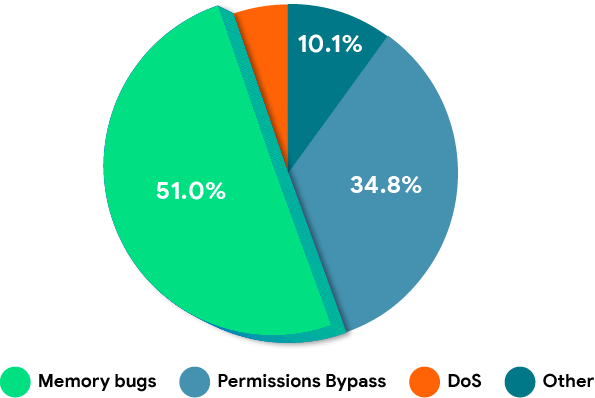

## TODO

- [ ] 添加 NUMA 架构图
- [ ] 更详细的 NUMA 架构说明
- [x] 更详细的稀疏内存模型介绍
- [ ] 添加 Linux 内存模型发展图

## 绪论

### 背景与意义

研究动力
研究目标
研究对象 局限于物理内存的分配与回收

### 现代操作系统内存管理技术概述

Linux 是目前市场占有率最高、影响力最大的开源操作系统内核，而且是云计算的基石。因此，笔者以 Linux 内核为例，概述现代操作系统内存管理技术现状。

目前，内存管理子系统是 Linux 内核最复杂的顶级子系统，以最新（截止 2023 年 5 月）的 Linux v6.2 版本为例，Linux 源代码目录 mm 共计 176 个文件、182932 余行代码（包括注释和空行），而作为云计算基石的 KVM（Kernel-based Virtual Machine）源代码仅有 9396 余行。

KVM 代码统计如下：

| Language | Files | Lines | Code | Comments | Blanks |
| -------- | ----- | ----- | ---- | -------- | ------ |
| C        | 10    | 9271  | 6451 | 1273     | 1547   |
| C Header | 4     | 121   | 75   | 26       | 20     |
| Makefile | 2     | 4     | 2    | 2        | 0      |
| Total    | 16    | 9396  | 6528 | 1301     | 1567   |

内存子系统代码统计如下：

| Language | Files | Lines  | Code   | Comments | Blanks |
| -------- | ----- | ------ | ------ | -------- | ------ |
| C        | 151   | 178276 | 113360 | 40752    | 24164  |
| C Header | 20    | 4424   | 2869   | 860      | 695    |
| Makefile | 5     | 232    | 178    | 26       | 28     |
| Total    | 176   | 182932 | 116407 | 41638    | 24887  |

内存管理子系统是操作系统内核最核心、最底层的子系统，被其余所有子系统依赖。因此，优秀的内存分配器必须做到以下几点：

1. 低内存碎片：内存碎片会导致系统内存资源利用率下降，甚至导致系统无法分配内存。

对于内存分配负载大的工作流（如游戏服务器）以及长期运行的系统（如移动设备），低内存碎片尤为重要。Linux 内核通过页面合并、内存重整、伙伴系统和 slab 分配器结合等技术降低内存碎片。

2. 低延迟：内存分配器应该尽可能地快速响应内存分配请求，以减少进程等待时间和系统负载。

低延迟的内存分配对于中断处理例程尤为重要。以接收网络包为例，网卡接收到数据包后，会向 CPU 发送中断信号，陷入到中断处理程序（interrupt handler）。中断处理程序必须尽快响应网卡的中断请求，并将数据包从网卡的接收缓冲区复制到内核的网络接收缓冲区（socket buffer）中，完成复制后才可以响应下一次网卡的中断请求。如果内存分配器的延迟过大甚至无可用内存，会导致中断处理程序失败或等待可用内存，极大降低系统吞吐量。

为此，Linux 内存分配器会系统保留一部分内存作为紧急内存池，用于系统内存吃紧时兜底。并通过 slab 分配器、内存池缓存生命周期短且可以循环利用的对象，以降低分配延迟。

3. 可扩展性：内存分配器应该能够处理不同规模的内存分配请求，能够适应系统负载的变化。

内存分配器既要能高效地支持小块内存分配，也应该支持大块内存分配，并且不局限于特定大小。例如，使用分离链表算法的内存分配器，会缓存特定大小的内存块，请求这些特定大小的内存块是时，响应时间极短，但对于其他大小的内存请求响应时间更长。

4. 内存安全：内存分配器应该能够确保内存分配和释放的安全性，避免内存泄漏和内存越界等问题。

5. 可定制性：内存分配器应该允许用户自定义内存分配策略，以适应特定的应用场景和系统需求。

例如在 x86 架构下，只有物理地址低于 32M 的物理内存可以用于 DMA，内存分配器必须能支持分配物理地址低于 32M 的物理内存。

除了这些传统的目标外，随着硬件技术的进步，目前操作系统内存分配器必须支持 NUMA 架构、内存热插拔、多核处理器等。

#### NUMA

_NUMA_（Non-uniform memory access) 即“非一致内存访问”，在高端服务器领域越来越流行。

在一个 NUMA 架构中，CPU 和内存被划分为多个节点，每个节点通常有多个 CPU 和多个内存控制器，节点通过高速互联网络连接在一起。每个 CPU 都有本地内存和远程内存，本地内存直接连接到本地 CPU，而远程内存需要通过互联网络连接到远程 CPU。因此访问本地内存的延迟比访问远程内存的延迟要小。因此，在 NUMA 架构中，需要对内存进行合理的分配，以充分利用本地内存，并尽量减少访问远程内存的次数，以提高系统的性能和效率。

NUMA 架构下不仅 CPU 访问本地内存和远程内存延迟不同，而且内存地址空间也变得更加稀疏和不连续，操作系统内核内存分配器必须应对这一挑战。

#### 内存热插拔

内存热插拔技术是一种可以在服务器运行时添加或删除物理内存的技术。使用内存热插拔技术在不停机的情况下进行增删物理内存是云计算时代下的基本需求。

内存热插拔技术在云计算中至少有以下典型应用场景：

1. 虚拟机内存扩容：云计算中的虚拟机通常会运行多个不同的应用程序，这些应用程序的内存需求可能随时变化。通过内存热插拔技术，虚拟机可以在运行状态下扩展内存，以满足应用程序的内存需求。
2. 虚拟机故障修复：虚拟机中的内存模块可能会出现故障，导致虚拟机无法正常运行。通过内存热插拔技术，可以在不影响虚拟机运行的情况下，快速替换故障的内存模块，恢复虚拟机的正常运行。

内存热插拔不仅需要硬件支持，更需要操作系统支持。内存管理子系统必须能够检测物理内存的插入和拔出，在插入时检测物理内存并将其纳入到内存子系统的管理之下，拔出内存时必时必须将内存的将内存中的数据迁移到系统的其他物理内存中，避免内存错误。

#### 多核处理器

在多核系统中，多个 CPU 可能同时请求内存，如果内存分配器不能很好地扩展，就会出现竞争和互斥等问题，从而导致性能瓶颈，甚至性能远低于单核系统。

为了提高内存分配器的可扩展性，Linux 内存子系统大量使用本地 CPU 缓存。Linux 内核中的几乎所有内存分配器都为每个 CPU 分配自己的本地缓存，优先从本地缓存分配内了存，以避免线程间同步。

#### 内存安全与调试

通常，内核检测的内存安全 bug 可以分为以下几类：

1. OOB(Out Of Bound)：内存访问越过了已分配内存的边界。
2. UAF(Use After Free)：访问已释放的内存。
3. Invalid Free: 无效释放，即内存释放函数（如 C 标准库的`free()`）释放的内存不是之前分配的内存。
4. Double Free：二次释放，即释放内存后又通过内存释放函数释放内存。

内存安全 bug 会对内核稳定性产生负面影响。[AOSP 安全性文档](https://source.android.google.cn/docs/security/memory-safety?hl=zh-cn)指出，内存安全 bug 和以原生编程语言处理内存时遇到的错误是 Android 代码库中最常见的问题。此类问题造成了超过 60% 的高严重程度安全漏洞，并造成了数百万次用户可见的崩溃。从第一个 Android 版本开始，内存安全 bug 就一直是 Android 安全漏洞的首要原因，约占 Android 安全漏洞的 51%。

随着代码的复杂性不断增长，如果一直坐视不管，内存安全 bug 的数量将随着时间的推移而持续增加。因此，现代操作系统必须提供检测并缓解此类 bug 的工具。

Linux 内核于 6.1 版本开始支持使用 Rust 语言编写驱动程序，试图通过引入内存安全型编程语言环境内存安全问题。此外，从 Linux 2.x 版本开始，Linux 内核就将内存安全 bug 检测作为内存管理子系统的重要功能。目前，Linux 内核中的几乎所有类型的内存分配都有对应的内存安全 bug 检测器，主要分为以下三种：

1. 内存分配器内置的调试功能：内存分配器在分配内存和释放时，检测是否发生内存安全 bug。这种方式无法在发生内存安全 bug 时立刻报告错误，但性能损耗比较小。

2. KASAN(The Kernel Address Sanitizer)：使用 shadow memory 记录所有内存的使用情况（正常/异常），即使用 1 字节记录 8 个字节的使用情况；通过编译器的协助，在内核代码的每一条内存访问指令前插入 KASAN 检测指令，检测是否出现内存安全 bug。KASAN 在每条内存访问指令前插入 KASAN 检测指令，导致严重的性能损耗；KASAN 使用 1 字节记录 8 个字节的使用情况，因此会占用系统总内存的 1/8。尽管 KASAN 不能用于生产环境，但可以及时报告内存错误，是 Linux 内核中功能最强的内存安全 bug 检测器。

3. KFENCE(Kernel Electric-Fence)：在 Linux 5.12 版本引入，仅检测通过 KFENCE 内存池分配的内存（kfence 对象），而且是周期性采样。KFENCE 性能开销比较低，可以用于生产环境，因此 Linux 5.12 版本后默认开启 KFENCE。

Linux 内核的三大类内存安全 bug 检测器总结如下：

| Debugger   | Overhead      | OOB              | UAF                | invalid free       | double free        |
| ---------- | ------------- | ---------------- | ------------------ | ------------------ | ------------------ |
| slub_debug | 中等            | 对象被释放时           | 对象被重新分配时           | 立即                 | 立即                 |
| kasan      | 非常高，不可用于生产环境。 | 立即               | 立即（对象被重新分配后不再检测）   | 立即                 | 立即                 |
| kfence     | 低，可用于生产环境。    | 立即或当kfence对象被释放时 | 立即（仅适用于 kfence 对象） | 立即（仅适用于 kfence 对象） | 立即（仅适用于 kfence 对象） |

### 论文主要工作与组织结构

第一章：绪论。首先阐述了论文选题的背景和意义，随后介绍了操作系统内存管理子系统的目标，最后概述了 Linux 内核内存管理子系统的最新进展。

第二章：内存模型。首先概述 Linux 内核的内存模型演化，然后介绍本系统使用的内存模型与相关数据结构。

第三章：页分配器。

第四章：对象分配器。

第五章：通用内存分配器。

## 内存模型

*内存模型*（*memory model*）指操作系统对物理内存的管理方式和组织结构。

Linux 内核的内存模型经历了三个阶段：平坦内存模型、非连续内存模型和稀疏内存模型。

### 平坦内存模型

在大多数处理器架构中，物理内存仅仅是物理地址空间的一部分，物理地址空间通常是不连续的，其中不可用的部分称为*内存空洞*（*memory hole*）。内存空洞包括：架构保留的区域，内存映射 IO，ROM 等等。

x86_64 典型的物理地址空间如下：

x86_64 架构中，前 1MB 物理地址空间称为*实模式地址空间*，以实模式地址空间为例，说明物理地址空间的复杂性：

| start                                   | end        | size                | description                            | type                                 |                                            |
| --------------------------------------- | ---------- | ------------------- | -------------------------------------- | ------------------------------------ | ------------------------------------------ |
| Real mode address space (the first MiB) |            |                     |                                        |                                      |                                            |
| 0x00000000                              | 0x000003FF | 1 KiB               | Real Mode IVT (Interrupt Vector Table) | unusable in real mode                | 640 KiB RAM ("Low memory")                 |
| 0x00000400                              | 0x000004FF | 256 bytes           | BDA (BIOS data area)                   |                                      |                                            |
| 0x00000500                              | 0x00007BFF | almost 30 KiB       | Conventional memory                    | usable memory                        |                                            |
| 0x00007C00                              | 0x00007DFF | 512 bytes           | Your OS BootSector                     |                                      |                                            |
| 0x00007E00                              | 0x0007FFFF | 480.5 KiB           | Conventional memory                    |                                      |                                            |
| 0x00080000                              | 0x0009FFFF | 128 KiB             | EBDA (Extended BIOS Data Area)         | partially used by the EBDA           |                                            |
| 0x000A0000                              | 0x000BFFFF | 128 KiB             | Video display memory                   | hardware mapped                      | 384 KiB System / Reserved ("Upper Memory") |
| 0x000C0000                              | 0x000C7FFF | 32 KiB (typically)  | Video BIOS                             | ROM and hardware mapped / Shadow RAM |                                            |
| 0x000C8000                              | 0x000EFFFF | 160 KiB (typically) | BIOS Expansions                        |                                      |                                            |
| 0x000F0000                              | 0x000FFFFF | 64 KiB              | Motherboard BIOS                       |                                      |                                            |

尽管物理地址空间如此复杂，但总体上内存仍然是连续的。平坦内存模型将物理地址空间视作由连续的物理页组成的数组，并使用数组`struct page mem_map[]`跟踪每一页的状态，包括是否已分配等等。

平坦内存模型有以下优点：

- 符合直觉，实现简单。

- 快速进行`struct page*`和物理页号`pfn`的转换。

### 非连续内存模型

二十一世纪初，NUMA 架构的逐渐普及，导致物理内存更加稀疏，平坦内存模型的问题暴露出来：

- 无法应对大量内存空洞：平坦内存模型使用全局数组`mem_map[]`追踪每个物理页的状态，即使某些页帧对应的物理地址没有实际的内存，Linux 也要为其分配`struct page`结构体，存在大量内存空洞意味着`mem_map[]`中相当一部分`struct page`被浪费。

- 不支持 NUMA 架构：NUMA 架构将内存划分为多个节点，而平坦内存模型却将物理内存视作一个连续的物理页数组。

为了克服平坦内存模型的上述问题，1999 年开始 Linux 引入了非连续内存模型以支持 NUMA 架构，该内存模型称为 DISCONTIGMEM。

在非连续内存模型中，内存被划分为多个节点，每个节点都有自己的`mem_map[]`数组，跟踪本节点内的物理页。

尽管非连续内存模型是为了支持 NUMA 架构而发生的，但非连续物理内存模型是操作系统的软件视角，不一定准确反映硬件 NUMA 布局。例如，操作系统可以把任意一块连续内存视作一个节点，而不用考虑硬件上 NUMA 架构的真实布局。论文后续部分会详细介绍。

### 稀疏内存模型

物理内存热插拔技术的进步，支持物理内存热插拔成为了对内核内存管理子系统的基本要求。在云计算场景下，往往需要通过内存热插拔可以用来实现动态扩容，但频繁的内存插拔也使得物理内存更加不连续。

内存热插拔技术使得大范围的连续物理内存不再场景，稀疏的物理内存称为常态。非连续内存模型尽管使得 Linux 成功支持 NUMA 架构，但非连续内存模型实际上只是连续物理内存的变体，每个节点内部都是连续内存模型。内存热插拔场景下的物理内存过于稀疏，粗粒度的非连续内存模型无法支持如此稀疏的物理内存布局。

因此，Linux 于 2005 年引入了原始的稀疏内存模型，称为 SPARSEMEM。SPARSEMEM 模型把粗粒度的节点，变成了更细粒度的`struct mem_section`。每个`mem_seciton`都有自己的内存管理结构`mem_map[]`，一个`mem_section`管理$2^{SECTION\_SIZE\_BIT}$字节物理内存，通常`SECTION_SIZE_BIT` 定义为 27，即一个`mem_section` 管理128MB内存。整个系统的内存管理结构被视作一个`mem_section`数组[^1]。

将 FLATMEM 模型中 `struct page` 必须从物理地址开始到结束而连续存在，变成了 `struct mem_section` 必须连续存在。在内存空洞的场景下，只需要每 128 MB 的物理地址空间存在一个 `struct mem_section` 即可（不要求分配`struct page`结构），而无需为每 4 KB 的物理地址空间都分配一个 `struct page`，减少了不必要的内存开销。而且，`mem_section`有上线和下线两个状态，对应内存的插入与拔出，通过 `struct mem_section` 的动态初始化与销毁实现物理内存热插拔。

[^1]: 实际上是一个 NR_SECTION_ROOTS * SECTION_PER_ROOT 大小的二维数组，因为SECTION_PER_ROOT 定义为 1，因此这里说是一维数组。

经典 SPARSEMEM 模型有两大缺点：

1. `mem_section[]`数组是固定分配的，而且覆盖整个物理地址空间，这会大量浪费内存。64 位处理器的地址空间极大，64 位 RISCV 架构支持$2^{56}$字节地址空间，x86_64 架构支持$2^{52}$字节或$2^{46}$字节物理地址空间，要覆盖 RISCV 架构的$2^{56}$字节物理地址空间，需要分配$2^{29} = 536,870,912$个`mem_section`结构体。

2. 页帧编号和`struct page*`之间的转换开销比平坦内存模型大。

这两个问题阻碍着 SPARSEMEM 完全替代 DISCONTIGMEM 内存模型，这两个问题已经分别通过 2005 年引入的 SPARSEMEM-EXTREME 拓展和 2007 年引入的SPARSEMEM-VMEMMAP 拓展解决了。

SPARSEMEM-EXTREME 将经典 SPARSEMEM 内存模型的`mem_section[NR_SECTION_ROOTS][1]`改成动态分配的`mem_section[NR_SECTION_ROOTS][SECTIONS_PER_ROOT]`，当某个`mem_seciton[SECTION_PER_ROOT]`对应的地址空间是内存空洞时，就不需要为其分配`struct mem_seciton`数组，从而减少了内存消耗。

SPARSEMEM-VMEMMAP 拓展的思路是：在 SPARSEMEM 中，`struct page` 为应对内存空洞，实际上不会连续存在，但可以设法安排每个 `struct page`（不管其存在与否）的虚拟地址是固定且连续的，因为分配虚拟地址并不会有实际的开销，反而可以方便进行索引。SPARSEMEM-VMEMMAP 内存模型可以如同平坦内存模型一样快速进行页帧编号和`struct page*`的切换，使得稀疏内存模型可以完全替代平坦内存模型和非连续内存模型。

2021 年提交补丁[Remove DISCINTIGMEM memory model](https://lwn.net/Articles/858333) 彻底移除了 DISCONFITMEM 内存模型，SPARSEMEM 内存模型成为 Linux 内核的默认内存模型。

### 本论文使用的内存模型及其实现

教学操作系统没有对内存热插拔的需求，非连续内存模型支持 NUMA 架构，并且复杂度适中，因此论文描述的系统实现了非连续内存模型。

目前本论文描述的操作系统是还不支持对称多处理器，因此将系统视为只有一个节点和一个 CPU 的 NUMA 架构机器，该节点并不包含整个物理地址空间，仅仅包含系统中的物理内存。节点内的物理内存被进一步划分为多个区域`struct zone`，每个区域都有自己独立的内存管理结构`struct page*mem_map`。上图展示了本论文实现的内存模型的逻辑结构。在实际的实现中，节点存储了整个节点内存区域的`struct page mem_map[]`，每个`zone`中的`struct page mem_map[]`只是指向节点的`mem_map[]`中对应区域的`struct page*`指针。物理结构如下图所示。

划分`zone`的依据是系统中不同区域的物理内存特性不同。例如，x86_64 架构中只有低 32MB 的物理内存能够用于 DMA，因此用于 DMA 的内存必须从该`zone`分配；在内存热插拔场景下，内核的代码数据要放在不会被下线（拔出）的内存区域中，而某些用户数据可以放在可能被下线的内存区域中，因此还应该将可能下线的内存区域划分为一个`zone`。本论文的实现基于 RISCV 架构，并且运行在 qemu 模拟器中，通过 virtio 协议操作外设，DMA 不对物理地址做限制，但仍然区分了常规内存分配请求和用于 DMA 的内存分配请求，将节点的内存划分为`ZONE_DMA`和`ZONE_NORMAL`区域，也许网络协议栈和驱动程序会有这方面的需求。

尽管目前不支持对称多处理器，无法完整地支持硬件 NUMA 架构，但已经在软件层面完成了绝大多数工作，未来支持对称多处理器后，只需要进行 NUMA 配置探测，初始化多个节点即可。

## 伙伴系统

伙伴系统是经典

### 物理内存的探测

### 伙伴系统的建立

### 内存分配与回收

## slab 分配器

### slab 分配器概述

### slab 分配器的初始化

### 对象分配与回收

### 调试功能

### slab 分配器与缓存

### slab 分配器与伙伴系统的交互

### kmalloc 缓存

## 致谢
